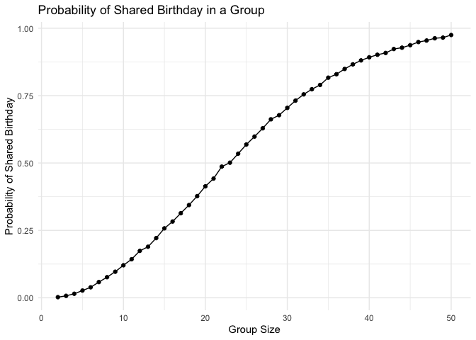
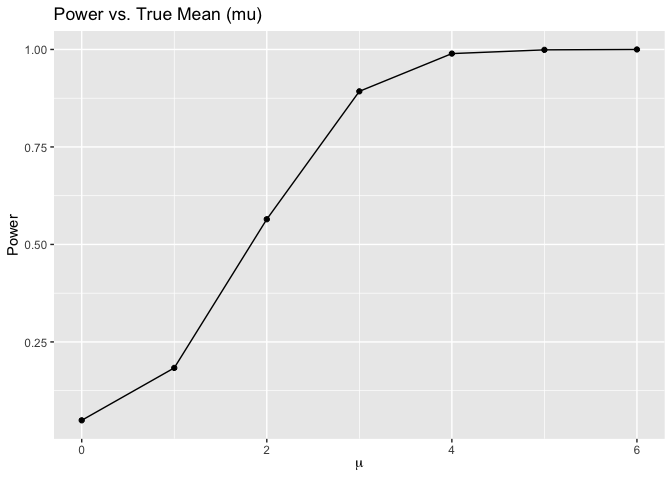
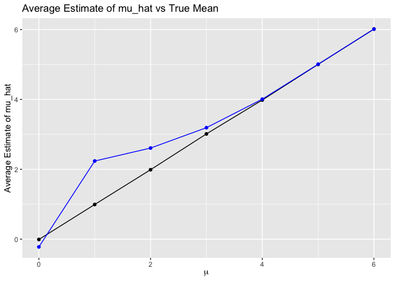

p8105_hw5_sz3214
================
2024-11-09

## Problem 1

**function**

``` r
birthday = function(n) {
  birthdays = sample(1:365, n, replace = TRUE) 
  duplication = any(duplicated(birthdays))  
  return(duplication)
}
```

**run function on different group sizes**

``` r
set.seed(42)  
n_simulation = 10000  
size = 2:50  
result = numeric(length(size))

for (i in seq_along(size)) {
  n = size[i]
  duplicate = replicate(n_simulation, birthday(n))  
  result[i] = mean(duplicate)  
}

data = data.frame(group_size = size, probability = result)
```

**draw the plot**

``` r
ggplot(data, aes(x = group_size, y = probability)) +
  geom_line() +
  geom_point() +
  labs(title = "Probability of Shared Birthday in a Group",
       x = "Group Size",
       y = "Probability of Shared Birthday") +
  theme_minimal()
```

<!-- -->

As the group size increases, the probability that at least two people in
the group share a birthday rises quickly.

## problem 2

**t-test**

``` r
n = 30  
sigma = 5 
alpha = 0.05 
num = 5000 
mu_value = c(0, 1, 2, 3, 4, 5, 6)

power = numeric(length(mu_value))
avg_estimates = numeric(length(mu_value))
avg_estimates_rejected = numeric(length(mu_value))

for (j in seq_along(mu_value)) {
  mu = mu_value[j]
  p_value = numeric(num)
  mu_hat = numeric(num)
  
  for (i in 1:num) {
    x = rnorm(n, mean = mu, sd = sigma)  
    t_test = t.test(x, mu = 0)  
    p_value[i] = t_test$p.value
    mu_hat[i] = t_test$estimate
  }
  
  power[j] = mean(p_value < alpha)
  avg_estimates[j] = mean(mu_hat)
  avg_estimates_rejected[j] = ifelse(sum(p_value < alpha) > 0, mean(mu_hat[p_value < alpha]), NA)
}
```

**plot mu vs power**

``` r
data.frame(mu = mu_value, power = power) |>
  ggplot(aes(x = mu, y = power)) +
  geom_line() +
  geom_point() +
  labs(title = "Power vs. True Mean (mu)", x = expression(mu), y = "Power")
```

<!-- -->

Effect size and power are positively correlated. The rate of increase in
power slows as the effect size becomes very large.

**plot avg mu_hat vs mu**

``` r
data.frame(mu = mu_value, avg_estimate = avg_estimates, avg_estimate_rejected = avg_estimates_rejected) |>
  ggplot(aes(x = mu)) +
  geom_line(aes(y = avg_estimate), color = "black") +
  geom_point(aes(y = avg_estimate), color = "black") +
  geom_line(aes(y = avg_estimate_rejected), color = "blue", na.rm = TRUE) +
  geom_point(aes(y = avg_estimate_rejected), color = "blue", na.rm = TRUE) +
  labs(title = "Average Estimate of mu_hat vs True Mean", x = expression(mu), y = "Average Estimate of mu_hat")
```

<!-- -->

The average estimate of $\hat{\mu}$ for tests where the null hypothesis
is rejected is approximately equal to the true value of $\mu$ because
these tests provide stronger evidence of a real effect, making the
estimates more accurate.
