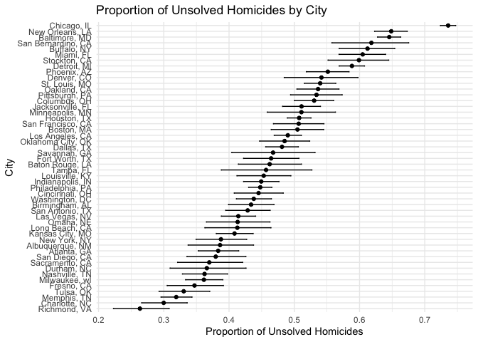

p8105_hw5_sz3214
================
2024-11-09

## Problem 1

**function**

``` r
birthday = function(n) {
  birthdays = sample(1:365, n, replace = TRUE) 
  duplication = any(duplicated(birthdays))  
  return(duplication)
}
```

**run function on different group sizes**

``` r
set.seed(42)  
n_simulation = 10000  
size = 2:50  
result = numeric(length(size))

for (i in seq_along(size)) {
  n = size[i]
  duplicate = replicate(n_simulation, birthday(n))  
  result[i] = mean(duplicate)  
}

data = data.frame(group_size = size, probability = result)
```

**draw the plot**

``` r
ggplot(data, aes(x = group_size, y = probability)) +
  geom_line() +
  geom_point() +
  labs(title = "Probability of Shared Birthday in a Group",
       x = "Group Size",
       y = "Probability of Shared Birthday") +
  theme_minimal()
```

<!-- -->

As the group size increases, the probability that at least two people in
the group share a birthday rises quickly.

## problem 2

**t-test**

``` r
n = 30  
sigma = 5 
alpha = 0.05 
num = 5000 
mu_value = c(0, 1, 2, 3, 4, 5, 6)

power = numeric(length(mu_value))
avg_estimates = numeric(length(mu_value))
avg_estimates_rejected = numeric(length(mu_value))

for (j in seq_along(mu_value)) {
  mu = mu_value[j]
  p_value = numeric(num)
  mu_hat = numeric(num)
  
  for (i in 1:num) {
    x = rnorm(n, mean = mu, sd = sigma)  
    t_test = t.test(x, mu = 0)  
    p_value[i] = t_test$p.value
    mu_hat[i] = t_test$estimate
  }
  
  power[j] = mean(p_value < alpha)
  avg_estimates[j] = mean(mu_hat)
  avg_estimates_rejected[j] = ifelse(sum(p_value < alpha) > 0, mean(mu_hat[p_value < alpha]), NA)
}
```

**plot mu vs power**

``` r
data.frame(mu = mu_value, power = power) |>
  ggplot(aes(x = mu, y = power)) +
  geom_line() +
  geom_point() +
  labs(title = "Power vs. True Mean (mu)", x = expression(mu), y = "Power")
```

<!-- -->

Effect size and power are positively correlated. The rate of increase in
power slows as the effect size becomes very large.

**plot avg mu_hat vs mu**

``` r
data.frame(mu = mu_value, avg_estimate = avg_estimates, avg_estimate_rejected = avg_estimates_rejected) |>
  ggplot(aes(x = mu)) +
  geom_line(aes(y = avg_estimate), color = "black") +
  geom_point(aes(y = avg_estimate), color = "black") +
  geom_line(aes(y = avg_estimate_rejected), color = "blue", na.rm = TRUE) +
  geom_point(aes(y = avg_estimate_rejected), color = "blue", na.rm = TRUE) +
  labs(title = "Average Estimate of mu_hat vs True Mean", x = expression(mu), y = "Average Estimate of mu_hat")
```

<!-- -->

The average estimate of $\hat{\mu}$ for tests where the null hypothesis
is rejected is approximately equal to the true value of $\mu$ because
these tests provide stronger evidence of a real effect, making the
estimates more accurate.

## problem 3

``` r
homicide = read.csv("homicide-data.csv")
str(homicide)
```

    ## 'data.frame':    52179 obs. of  12 variables:
    ##  $ uid          : chr  "Alb-000001" "Alb-000002" "Alb-000003" "Alb-000004" ...
    ##  $ reported_date: int  20100504 20100216 20100601 20100101 20100102 20100126 20100127 20100127 20100130 20100210 ...
    ##  $ victim_last  : chr  "GARCIA" "MONTOYA" "SATTERFIELD" "MENDIOLA" ...
    ##  $ victim_first : chr  "JUAN" "CAMERON" "VIVIANA" "CARLOS" ...
    ##  $ victim_race  : chr  "Hispanic" "Hispanic" "White" "Hispanic" ...
    ##  $ victim_age   : chr  "78" "17" "15" "32" ...
    ##  $ victim_sex   : chr  "Male" "Male" "Female" "Male" ...
    ##  $ city         : chr  "Albuquerque" "Albuquerque" "Albuquerque" "Albuquerque" ...
    ##  $ state        : chr  "NM" "NM" "NM" "NM" ...
    ##  $ lat          : num  35.1 35.1 35.1 35.1 35.1 ...
    ##  $ lon          : num  -107 -107 -107 -107 -107 ...
    ##  $ disposition  : chr  "Closed without arrest" "Closed by arrest" "Closed without arrest" "Closed by arrest" ...

The raw dataset has 52179 observations and 12 variables, including uid,
reported_date, victim_last, victim_first, victim_race, victim_age,
victim_sex, city, state, lat, lon and disposition.

**create new variable**

``` r
homicide_count = homicide |>
  mutate(state = ifelse(city == "Tulsa" & state == "AL", "OK", state)) |>
  mutate(city_state = paste(city, state, sep = ", ")) |>
  group_by(city_state) |>
  summarise(
    total_homicides = n(),
    unsolved_homicides = sum(disposition %in% c("Closed without arrest", "Open/No arrest"))
  )

homicide_count
```

    ## # A tibble: 50 × 3
    ##    city_state      total_homicides unsolved_homicides
    ##    <chr>                     <int>              <int>
    ##  1 Albuquerque, NM             378                146
    ##  2 Atlanta, GA                 973                373
    ##  3 Baltimore, MD              2827               1825
    ##  4 Baton Rouge, LA             424                196
    ##  5 Birmingham, AL              800                347
    ##  6 Boston, MA                  614                310
    ##  7 Buffalo, NY                 521                319
    ##  8 Charlotte, NC               687                206
    ##  9 Chicago, IL                5535               4073
    ## 10 Cincinnati, OH              694                309
    ## # ℹ 40 more rows

**Baltimore**

``` r
homicide_count |>
  filter(city_state == "Baltimore, MD") |>
  summarise(prop_test = list(prop.test(unsolved_homicides, total_homicides))) |>
  mutate(output = map(prop_test, broom::tidy)) |>
  unnest(output) |>
  select(estimate, conf.low, conf.high)
```

    ## # A tibble: 1 × 3
    ##   estimate conf.low conf.high
    ##      <dbl>    <dbl>     <dbl>
    ## 1    0.646    0.628     0.663

**each city**

run prop.test

``` r
each_city = homicide_count |>
  mutate(
    prop_test = purrr::map2(unsolved_homicides, total_homicides, ~prop.test(.x, .y) |> broom::tidy()),
    estimate = purrr::map(prop_test, ~.x$estimate),
    conf.low = purrr::map(prop_test, ~.x$conf.low),
    conf.high = purrr::map(prop_test, ~.x$conf.high)
  ) |>
  unnest(c(estimate, conf.low, conf.high)) |>
  select(city_state, estimate, conf.low, conf.high)

each_city
```

    ## # A tibble: 50 × 4
    ##    city_state      estimate conf.low conf.high
    ##    <chr>              <dbl>    <dbl>     <dbl>
    ##  1 Albuquerque, NM    0.386    0.337     0.438
    ##  2 Atlanta, GA        0.383    0.353     0.415
    ##  3 Baltimore, MD      0.646    0.628     0.663
    ##  4 Baton Rouge, LA    0.462    0.414     0.511
    ##  5 Birmingham, AL     0.434    0.399     0.469
    ##  6 Boston, MA         0.505    0.465     0.545
    ##  7 Buffalo, NY        0.612    0.569     0.654
    ##  8 Charlotte, NC      0.300    0.266     0.336
    ##  9 Chicago, IL        0.736    0.724     0.747
    ## 10 Cincinnati, OH     0.445    0.408     0.483
    ## # ℹ 40 more rows

plot

``` r
each_city |>
  ggplot(aes(x = reorder(city_state, estimate), y = estimate)) +
  geom_point() +
  geom_errorbar(aes(ymin = conf.low, ymax = conf.high), width = 0.2) +
  coord_flip() +
  labs(title = "Proportion of Unsolved Homicides by City", x = "City", y = "Proportion of Unsolved Homicides") +
  theme_minimal()
```

<!-- -->
